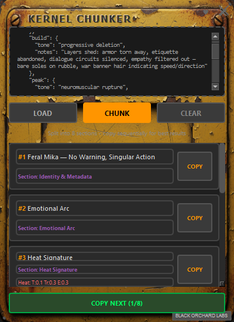

# Kernel Chunker

A retro-industrial desktop tool for splitting large PRISM kernel decks into digestible chunks.


[](https://ko-fi.com/blackorchardlabs)



## Overview

Large kernel decks can overwhelm LLM context windows, causing the "lost in the middle" problem where models only attend to the first and last items. Kernel Chunker solves this by letting you feed kernels one at a time.

## Features

- **Retro-Industrial UI** - Matches the PyPulse aesthetic with weathered metal textures, rivets, and embossed text
- **File Browser** - LOAD button opens a file picker (recommended)
- **Paste Support** - Paste JSON directly into the input area
- **Drag & Drop** - Experimental; may not work reliably on all systems
- **Sequential Copy** - COPY NEXT button walks through kernels one by one
- **Visual Feedback** - Copied chunks grey out until you start over
- **Individual Copy** - Each chunk card has its own COPY button

## Installation

### From Source

```bash
# Install dependencies
pip install PyQt6

# Run directly
python kernel_chunker.pyw
```

### Build Standalone Executable

```bash
# Windows (PowerShell)
.uild_exe.ps1

# Windows (Command Prompt)
build_exe.bat
```

The executable will be created in the `dist/` folder.

## Usage

1. **Load a kernel deck** - Click LOAD to open a file picker, or paste JSON directly
2. **Click CHUNK** - Parses the JSON and displays individual kernel cards
3. **Copy kernels** - Click COPY on individual cards, or use COPY NEXT for sequential copying
4. **Paste to Mika** - Each kernel is copied as valid JSON ready to paste
5. **Start Over** - After copying all chunks, click START OVER to reset

## Kernel Deck Format

Kernel Chunker accepts PRISM kernel deck JSON in these formats:

```json
{
  "kernels": [
    {
      "id": "<kernel_id>",
      "title": "<title>",
      "metadata": {
        "field_1": "<value>",
        "field_2": "<value>",
        "field_3": "<value>"
      },
      "content": { ... }
    }
  ]
}
```

Or a simple array of kernels:

```json
[
  { "id": "<kernel_id>", "title": "<title>", ... },
  { "id": "<kernel_id>", "title": "<title>", ... }
]
```

## Project Structure

```
kernel_chunker/
├── kernel_chunker.pyw   # Main application
├── assets/
│   └── body_yellow.png  # Background texture
├── build_exe.bat        # Windows batch build script
├── build_exe.ps1        # PowerShell build script
└── README.md
```

## Requirements

- Python 3.10+
- PyQt6
- PyInstaller (for building executable)

## Support

If you find this tool useful, consider [buying us a coffee](https://ko-fi.com/blackorchardlabs)!

## License

Part of the Hermes PRISM project by Black Orchard Labs.

---

*"Beauty first, utility later."*
